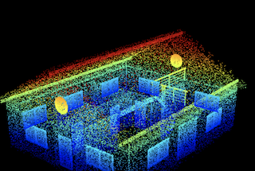

# ifcclouds
==============================

Ifc cloudpoint sdg

 

This project is a collection of scripts to generate point clouds from IFC files. The point clouds can be used for machine learning and other applications. The synthetic data is generated by extracting the meshes by ifc-entity-type and distributing points over each face using barycentric coordinates and a weightend sampler-algorithm with respect to triangle-size. All mesh-points are concatenated to a single point cloud. The point cloud is then saved as a .ply file with the format float float float int, where the first three values are coordinates and the fourth value is the class label.

## Installation
```
git clone 
cd ifcclouds
python3 -m venv venv
source venv/bin/activate
python3 -m pip install -r requirements.txt
```

## Getting Started

### Download IFC files
Download the IFC files and extract them to the `data/raw` folder. The folder structure should look like this:

data
└── raw
    ├── sample1.ifc
    ├── sample2.ifc
    ├── sample3.ifc
    ├── sample4.ifc
    ├── sample5.ifc
    ├── sample6.ifc
    ├── sample7.ifc
    ├── sample8.ifc
    ...

### Convert IFC files to point clouds
```
python3 -m src.data.make_dataset
```

## To Do
- [ ] Split data into train, validation and test set
- [ ] Add more models

## Project Organization
------------

    ├── LICENSE
    ├── Makefile           <- Makefile with commands like `make data` or `make train`
    ├── README.md          <- The top-level README for developers using this project.
    ├── data
    │   ├── external       <- Data from third party sources.
    │   ├── interim        <- Intermediate data that has been transformed.
    │   ├── processed      <- The final, canonical data sets for modeling.
    │   └── raw            <- The original, immutable ifc data dump.
    │
    ├── docs               <- A default Sphinx project; see sphinx-doc.org for details
    │
    ├── models             <- Trained and serialized models, model predictions, or model summaries
    │
    ├── notebooks          <- Jupyter notebooks. Naming convention is a number (for ordering),
    │                         the creator's initials, and a short `-` delimited description, e.g.
    │                         `1.0-jqp-initial-data-exploration`.
    │
    ├── references         <- Data dictionaries, manuals, and all other explanatory materials.
    │
    ├── reports            <- Generated analysis as HTML, PDF, LaTeX, etc.
    │   └── figures        <- Generated graphics and figures to be used in reporting
    │
    ├── requirements.txt   <- The requirements file for reproducing the analysis environment, e.g.
    │                         generated with `pip freeze > requirements.txt`
    │
    ├── setup.py           <- makes project pip installable (pip install -e .) so src can be imported
    ├── src                <- Source code for use in this project.
    │   ├── __init__.py    <- Makes src a Python module
    │   │
    │   ├── data           <- Scripts to download or generate data
    │   │   └── make_dataset.py
    │   │
    │   ├── features       <- Scripts to turn raw data into features for modeling
    │   │   └── build_features.py
    │   │
    │   ├── models         <- Scripts to train models and then use trained models to make
    │   │   │                 predictions
    │   │   ├── predict_model.py
    │   │   └── train_model.py
    │   │
    │   └── visualization  <- Scripts to create exploratory and results oriented visualizations
    │       └── visualize.py
    │
    └── tox.ini            <- tox file with settings for running tox; see tox.readthedocs.io


--------

<p><small>Project based on the <a target="_blank" href="https://drivendata.github.io/cookiecutter-data-science/">cookiecutter data science project template</a>. #cookiecutterdatascience</small></p>
